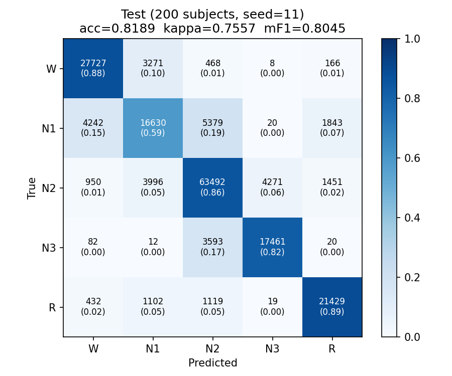
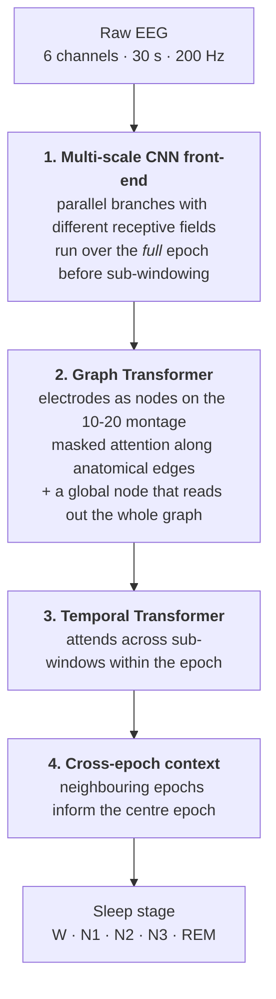
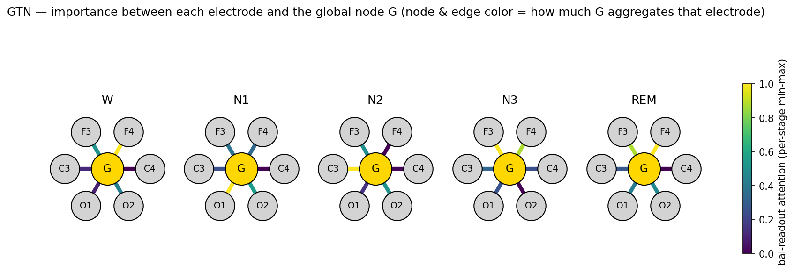
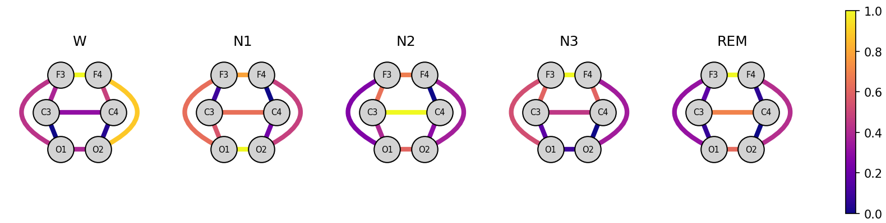
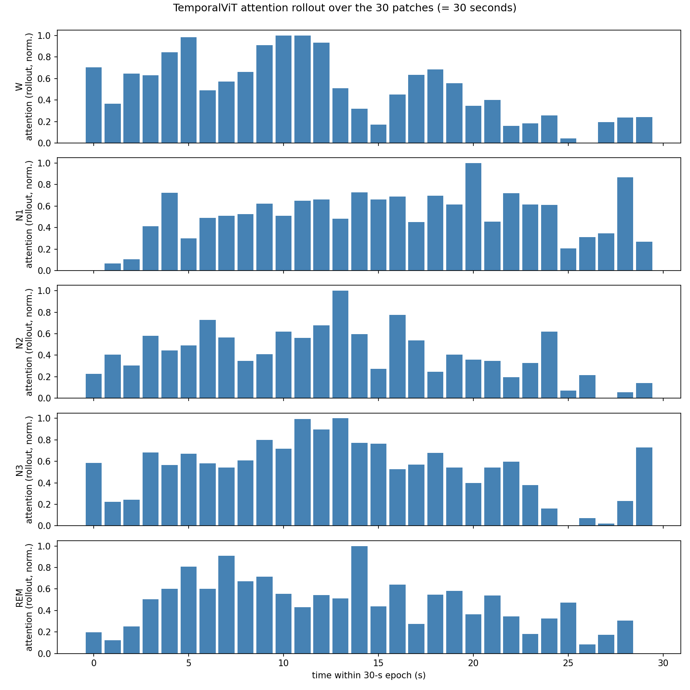

# SleepGTH

**A Graph–Transformer Hybrid for automatic sleep staging from raw multi-channel EEG.**

SleepGTH classifies 30-second polysomnography epochs into the five AASM sleep stages
(W, N1, N2, N3, REM) directly from raw EEG — no hand-crafted spectral features, no
manual artifact rejection.

Its core idea is that a sleep epoch has **three different kinds of structure**, and each
deserves its own inductive bias:

| Structure | Handled by |
|---|---|
| Waveform morphology at multiple time scales (spindles → slow waves) | Multi-scale convolutional front-end |
| Spatial relationships between scalp electrodes | Graph Transformer over the 10–20 montage |
| How the signal evolves within and across epochs | Temporal Transformer + cross-epoch context |

Most sleep-staging models treat the EEG channels as an unordered feature stack. SleepGTH
instead treats them as **nodes on the anatomical 10–20 electrode graph**, so information
flows along physically meaningful connections rather than through a dense mixing layer.

---

## Results

Evaluated on the [PhysioNet/CinC Challenge 2018](https://physionet.org/content/challenge-2018/)
dataset, using **6 EEG channels only** (F3, F4, C3, C4, O1, O2). Train, validation and test
subjects are disjoint — no recording is ever split across sets.

**Best model — 200 held-out test subjects (~200k epochs):**

| Accuracy | Cohen's κ | Macro-F1 |
|:---:|:---:|:---:|
| **0.819** | **0.756** | **0.805** |

Per-stage recall: W 0.88 · N1 0.59 · N2 0.86 · N3 0.82 · REM 0.89

<p align="center">
  
</p>

N1 is the dominant error source — it is confused with W and N2, which matches the known
difficulty of N1 as a transitional stage with low inter-scorer agreement even among human
experts.

### Ablation — do the graph and the transformer actually earn their place?

Four models trained on an **identical subject split** and scored on the same held-out
validation subjects. Only the architecture differs.

| Variant | Electrode graph | Temporal transformer | Val κ |
|---|:---:|:---:|:---:|
| **Full model** | ✓ | ✓ | **0.740** |
| − temporal transformer | ✓ | ✗ | 0.729 |
| − electrode graph | ✗ | ✓ | 0.725 |
| − both | ✗ | ✗ | 0.697 |

Both components contribute, and removing them together costs more than the sum of removing
each alone — the spatial and temporal modules are **complementary, not redundant**.

---

## How it works



**1 — Multi-scale convolutional front-end.**
Parallel convolution branches with different receptive fields capture short transients
(spindles, K-complexes) and slow rhythms (delta waves) in the same pass. Crucially, the
convolutions run over the *complete* 30-second epoch *before* it is cut into sub-windows,
so every sub-window feature is computed with full-epoch context instead of being blind to
what happens on either side of its boundary.

**2 — Graph Transformer over the electrode montage.**
The electrodes become nodes of a fixed anatomical graph derived from the 10–20 system:
lateral pairs, fronto-occipital chains, and long-range diagonal shortcuts. Attention is
**masked to this graph**, so an electrode can only attend to its anatomical neighbours.
The long-range edges keep the graph diameter small, which means a shallow stack of graph
layers is enough for any electrode to reach any other.

A learnable **global node** is connected to all electrodes and is refined alongside them.
Its final embedding — a *dynamic, input-dependent* weighting of the electrodes rather than
a fixed average — becomes the representation of that sub-window.

**3 — Temporal Transformer.**
The sub-window representations form a sequence, and a Pre-LN Transformer with fixed
sinusoidal position encoding models how the signal evolves *inside* the epoch. This is what
lets the model notice that, say, a spindle occurred halfway through rather than merely that
spindle-like energy was present somewhere.

**4 — Cross-epoch context.**
Sleep stages are highly autocorrelated: a scorer never reads one epoch in isolation. A
second Transformer sees a window of neighbouring epochs and classifies only the centre one,
giving the model the same contextual cue a human scorer relies on.

---

## Interpretability

Because both spatial and temporal mixing happen through attention, the model can be asked
*where* and *when* it looked. All figures below are attention maps extracted from the
trained model, averaged per sleep stage.

**Which electrodes does the global readout rely on?**

<p align="center">
  
</p>

**Which anatomical connections carry the most information?**

<p align="center">
  
</p>

The spatial emphasis shifts with stage in a physiologically sensible way — frontal
electrodes dominate in deep sleep, where slow-wave activity is frontally maximal, while
occipital involvement is more pronounced in the lighter stages.

**When inside the 30 seconds does the model look?**

<p align="center">
  
</p>

Attention is clearly non-uniform: the model concentrates on specific moments rather than
averaging the epoch, which is consistent with staging decisions being driven by discrete
graphoelements.

---

## Repository layout

```
models/
  sleepgth.py           end-to-end model assembly and cross-epoch context
  spatial_encoder.py    multi-scale CNN, electrode graph, masked graph attention
  temporal_vit.py       within-epoch temporal transformer
datasets/
  cinc2018.py           CinC 2018 epoch dataset with subject-level splitting
  augment.py            signal-space augmentations
losses/
  classification.py     weighted cross-entropy / focal loss
engine/
  train.py              train & evaluate loops
scripts/
  train_single.py       training entry point
  test_random.py        evaluate on randomly sampled held-out subjects
  visualize_attention.py extract the attention figures shown above
  subset_cache.py       build a smaller cache for quick experiments
utils/
  scheduler.py          warmup + cosine schedule
```

---

## Setup

```bash
git clone https://github.com/n0203017888/SleepGTH.git
cd SleepGTH
pip install -r requirements.txt
```

Tested on Python 3.10 with PyTorch 2.4 (CUDA).

### Data

Download the [PhysioNet/CinC Challenge 2018](https://physionet.org/content/challenge-2018/)
training set and build the local cache. The cache builder extracts the 6 EEG channels,
bandpass-filters them and stores one array per recording:

```bash
python -m datasets.cinc2018 --data-root <PATH_TO_CinC2018>/training --out-dir ./cache_dataset
```

The cache is large (hundreds of GB for the full set) and is not tracked by git.
`scripts/subset_cache.py` builds a smaller subset for quick iteration.

### Train

```bash
python scripts/train_single.py --cache-dir ./cache_dataset --ckpt-dir ./runs/exp1
```

### Evaluate

```bash
python scripts/test_random.py --cache-dir ./cache_dataset \
    --ckpt ./runs/exp1/best.pt --n-subjects 200 \
    --exclude-splits ./runs/exp1/splits.json
```

`--exclude-splits` guarantees the evaluation subjects were never seen during training.
Run `--help` on either script for the full option list.

### Visualize attention

```bash
python scripts/visualize_attention.py --ckpt ./runs/exp1/best.pt --out-dir ./figures
```

---

## Notes and limitations

- Results are reported on a single dataset; **cross-dataset generalization is not yet
  evaluated**, and sleep-staging models are known to degrade across recording setups.
- The electrode graph is fixed by anatomy rather than learned. This is a deliberate
  inductive bias, but it assumes a standard 10–20 montage and does not adapt to unusual
  channel configurations.
- N1 recall (~0.59) remains the weakest point, consistent with the literature.
- Trained checkpoints are not included in this repository.

## Acknowledgements

Data from the [PhysioNet/CinC Challenge 2018](https://physionet.org/content/challenge-2018/),
"You Snooze, You Win". Please follow the original dataset licence and citation requirements.
